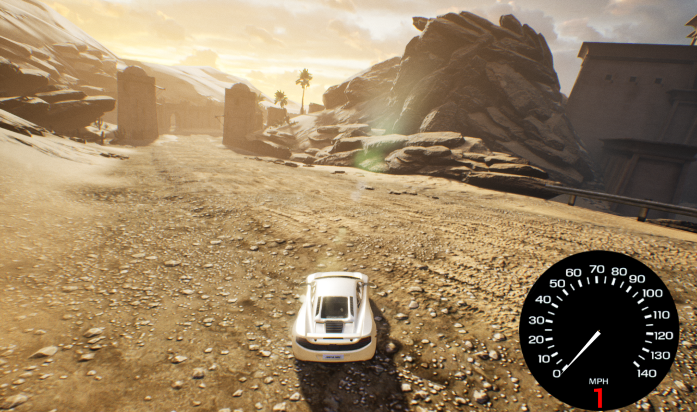

# CarRacing
### develop with unreal engine 4

### Note:  
~	showdebug vehicle  显示车辆信息  

代码无提示，可通过点击编辑器的 文件->刷新visual studio项目->打开visual studio  解决。  

`AVehicle : public AWheeledVehicle` 会导致继承`AVehicle`的蓝图，重启UE4编辑器后继承`AWheeledVehicle`  
`AMyVehicle : public AWheeledVehicle` 蓝图继承`AMyVehicle`不会丢失继承关系。  

一般使用development editor进行开发，可使用Engine\Extras\UnrealVS\VS2015\UnrealVS.vsix插件直接在visual studio中编译。  
断点调试时使用debuggame editor。  

打包发版时需设置GameDefaultMap防止黑屏。  

  

双击蓝图连线可生成节点  
GameMode只存在服务器中，可使用GameState进行网络复制。  
PlayerController存在于服务器和拥有该玩家控制器的客户端上。  
Pawn存在于服务器和所有客户端上。  
通过IsLocalController()判断是否是本地控制玩家。  